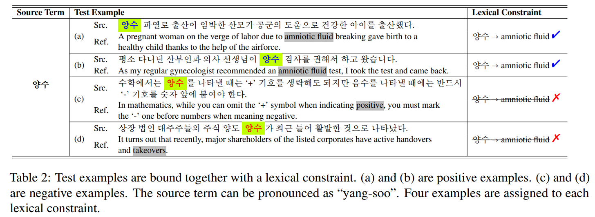
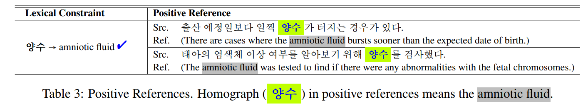

# HOLLY-benchmark
## Overview

This repository contains a novel dataset for semantically appropriate application of lexical constraints in NMT. Detailed descriptions are provided in the paper: 

 [**Towards Accurate Translation via Semantically Appropriate Application of Lexical Constraints**](https://arxiv.org/pdf/2306.12089.pdf)
    
- Yujin Baek*, Koanho Lee*, Dayeon Ki, Cheonbok Park, Hyoung-Gyu Lee, and Jaegul Choo
- Findings of ACL 2023

## HOLLY-benchmark

### Test data

Each test example (in `data/holly_test.json`) consists of 7 items. Here, we provide a brief explanation for each item based on the following images. 






- `guid`: a unique identifier for each example
- `homograph_word`: a homograph word identified in the `source_sentence` (`양수`)
- `source_sentence`: a source sentence which should be translated
- `lexical_constraint`: 
    - `source_term`: `양수`
    - `target_term`: `amniotic fluid`
- `positive_references`: two positive examples demonstrating the specific use of the `homograph_word`
- `translation`: a desirable translation of the `source_sentence`
- `label`: `1` (for positive examples) or `0` (for negative examples)


### Train & Validation data

We also provide train/validation examples for developing homograph disambiguation module:
- `data/holly_train.json`
- `data/holly_valid.json`


### License 
Licensed under [CC BY-SA KR 2.0](https://stdict.korean.go.kr/join/copyrightPolicy.do)
```
HOLLY-benchmark
Copyright (c) 2023-present NAVER Cloud Corp.
Creative Commons Attribution-ShareAlike 2.0 Generic license

A summary of the CC BY-SA 2.0 license is located here:
   https://creativecommons.org/licenses/by-sa/2.0/ 
   https://creativecommons.org/licenses/by-sa/2.0/kr/ (KR)
```

### Acknowledgement 
We modified following soruces in order to create our benchmark dataset.
Specifically, source sentences and positive references were collected from three open-source dictionaries from the National Institute of Korean Language: 
1) [Standard Korean Language Dictionary](https://stdict.korean.go.kr/main/main.do)
2) [Basic Korean Dictionary](https://krdict.korean.go.kr/mainAction)
3) [Urimalsaem](https://opendict.korean.go.kr/main)

